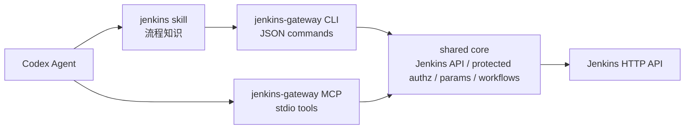

# CLI + Skill 改进方案

## 结论

不建议把当前 MCP 直接替换为 `jenkins-cli + skill`。更合适的路线是把项目改造成：

```text
shared core + CLI + MCP + Codex skill
```

其中：

- shared core 承担 Jenkins API、认证、参数解析、受保护工具授权、日志边界控制和工作流编排。
- CLI 面向脚本、CI、本地调试和 skill 调用，输出稳定 JSON。
- MCP 面向 Codex、Claude Desktop 等 MCP 客户端，提供可发现的结构化 tools。
- Codex skill 沉淀业务流程知识，例如“海外 release 前端升级”的固定步骤。

这样可以保留 MCP 的通用性，同时让 Codex 在复杂 Jenkins 操作中减少多次 tool call，提高执行稳定性。

## 为什么不是替换 MCP

纯 CLI + skill 的优势：

- 多步工作流可以在一个 CLI 命令里完成，例如查参数、触发构建、等待队列、读取结果。
- Jenkins 参数页 HTML 解析、Extended Choice 参数提取等脆弱逻辑更适合写成确定性代码。
- CLI 更容易在本地和 CI 中调试，也便于非 MCP 场景复用。
- skill 能保存团队内部 Jenkins 命名规则和操作流程，降低 agent 每次重新推理的成本。

纯 CLI + skill 的不足：

- skill 不是通用协议，其他 MCP 客户端不能直接复用。
- agent 通过 shell 调 CLI 时，安全边界不如 MCP tool schema 清晰。
- CLI 的参数校验、权限控制、输出脱敏必须自己做严，否则容易绕过保护。

MCP 的优势：

- tool schema 可被客户端发现，参数结构清晰。
- read/write tool 可以通过注解和配置开关做显式边界。
- 适合跨客户端复用。

因此推荐保留 MCP，但让 MCP 变薄：MCP tools 调用 shared core；CLI 也调用同一个 shared core。

## 目标架构



## 代码结构

建议把当前代码重构为以下结构：

```text
src/
  core/
    config.ts
    redaction.ts
    jenkins-client.ts
    job-paths.ts
    authz.ts
    views.ts
    parameters.ts
    builds.ts
    workflows.ts
    errors.ts
  cli/
    index.ts
    commands/
      server-info.ts
      jobs.ts
      views.ts
      params.ts
      build.ts
      workflow.ts
  mcp/
    server.ts
    tools.ts
  cli.ts
  mcp.ts
skills/
  jenkins-workflow/
    SKILL.md
    references/
      workflows.md
```

现有 `src/jenkins/client.ts`、`src/jenkins/paths.ts`、`src/config.ts`、`src/redact.ts` 可以迁移到 `src/core/`。

## CLI 命令设计

CLI 必须默认输出 JSON，便于 skill 和其他自动化稳定解析。

基础探测：

```bash
jenkins-gateway server info --json
```

View 查询：

```bash
jenkins-gateway view list --json
jenkins-gateway view get "example-release-view" --json
```

Job 查询：

```bash
jenkins-gateway job list --json
jenkins-gateway job list --view "example-release-view" --json
jenkins-gateway job get "example-job" --json
```

参数查询：

```bash
jenkins-gateway job params "example-upgrade-job" --json
```

构建触发：

```bash
jenkins-gateway build trigger "example-job" --json
jenkins-gateway build trigger "example-upgrade-job" --param serviceList=example-component --json
```

等待结果：

```bash
jenkins-gateway build wait "example-job" 123 --timeout 900 --json
```

组合工作流：

```bash
jenkins-gateway workflow upgrade-component \
  --compile-job "example-front-release-build" \
  --upgrade-job "example-release-upgrade-job" \
  --component "example-front-release-component" \
  --wait \
  --json
```

## 参数化构建细节

当前 MCP 已支持通用参数化触发：

```json
{
  "jobPath": "example-upgrade-job",
  "parameters": {
    "serviceList": "example-component"
  }
}
```

但它还不是完整的“参数化构建助手”。改进目标：

1. `parameters.ts` 支持读取 Jenkins 参数定义。
2. 对标准 `ChoiceParameterDefinition`、`StringParameterDefinition`、`BooleanParameterDefinition` 做结构化解析。
3. 对 Extended Choice checkbox 参数，优先从 Jenkins build 页面提取候选值。
4. 支持单值和多值参数：

```json
{
  "serviceList": ["component-a", "component-b"]
}
```

5. 触发前校验：

- 必填参数是否缺失。
- 参数值是否在候选值中。
- 多选参数是否使用数组或允许的拼接格式。
- 参数校验失败时不发送 Jenkins POST。

建议 CLI 输出：

```json
{
  "jobPath": "example-upgrade-job",
  "parameters": [
    {
      "name": "serviceList",
      "kind": "extended-choice-checkbox",
      "required": true,
      "choices": ["example-component"],
      "source": "build-page-html"
    }
  ]
}
```

## 受保护工具授权设计

普通读工具默认允许，例如 `jenkins.get_server_info`、`jenkins.list_jobs`、`jenkins.get_job`、`jenkins.get_build`、`jenkins.get_queue_item`、`jenkins.list_views`、`jenkins.get_view`。

受保护工具默认拒绝，必须显式允许：

- `jenkins.trigger_build`
- `jenkins.stop_build`
- `jenkins.get_console_log`
- 后续如增加 artifact 下载、凭据相关探测等高风险读操作，也应归入受保护工具。

推荐新增统一主开关和三级权限配置：

```text
JENKINS_MCP_ENABLE_PROTECTED_TOOLS=false
JENKINS_MCP_PROTECTED_ALLOW_ALL=false
JENKINS_MCP_PROTECTED_VIEW_ALLOWLIST=example-release-view,example-stage-view
JENKINS_MCP_PROTECTED_VIEW_DENYLIST=example-danger-view
JENKINS_MCP_PROTECTED_JOB_ALLOWLIST=example-job-a,folder/example-job-b
JENKINS_MCP_PROTECTED_JOB_DENYLIST=example-danger-job
JENKINS_MCP_CONSOLE_LOG_MAX_BYTES=65536
```

权限粒度按 job > view > all 处理；同一级别内 deny 优先于 allow。

权限判断顺序：

1. `JENKINS_MCP_ENABLE_PROTECTED_TOOLS=false`：拒绝。
2. job 命中 `PROTECTED_JOB_DENYLIST`：拒绝。
3. job 命中 `PROTECTED_JOB_ALLOWLIST`：允许。
4. job 所属任一 view 命中 `PROTECTED_VIEW_DENYLIST`：拒绝。
5. job 所属任一 view 命中 `PROTECTED_VIEW_ALLOWLIST`：允许。
6. `JENKINS_MCP_PROTECTED_ALLOW_ALL=true`：允许。
7. 其他情况：拒绝。

这个规则支持三类生产配置：

- 全部受保护工具可用，但排除某些 view/job：开启 `PROTECTED_ALLOW_ALL`，同时配置 view/job denylist。
- 某个 view 可用，但排除其中某些 job：配置 view allowlist 和 job denylist。
- 某个 view 默认不可用，但单工程例外允许：配置 view denylist 和 job allowlist，因为 job 粒度优先于 view。

当一个 job 同时出现在多个权限不同的 view 中，view 级别同级冲突按 deny 优先处理。但 job 级别配置更细，会覆盖 view 级别配置。

`jenkins.get_console_log` 虽然不是写操作，但应按受保护工具处理。它不对 Jenkins console 内容做脱敏，避免破坏排障上下文；同时必须有默认最大读取量，且不得把原始 console 内容写入本地 stderr、日志文件或错误对象。

Codex `config.toml` 在阶段 C 完成后的目标配置示例：

```toml
[mcp_servers.jenkins]
command = "jenkins-gateway"
args = ["mcp", "stdio"]

[mcp_servers.jenkins.env]
JENKINS_URL = "https://jenkins.example.com/"
JENKINS_USER_ID = "replace-with-jenkins-user-id"
JENKINS_API_TOKEN = "replace-with-jenkins-api-token"
JENKINS_MCP_ENABLE_PROTECTED_TOOLS = "true"
JENKINS_MCP_PROTECTED_ALLOW_ALL = "false"
JENKINS_MCP_PROTECTED_VIEW_ALLOWLIST = "example-release-view,example-stage-view"
JENKINS_MCP_PROTECTED_VIEW_DENYLIST = "example-danger-view"
JENKINS_MCP_PROTECTED_JOB_ALLOWLIST = ""
JENKINS_MCP_PROTECTED_JOB_DENYLIST = "example-danger-job"
JENKINS_MCP_CONSOLE_LOG_MAX_BYTES = "65536"
```

如果确实需要临时放开全部受保护工具权限，应显式配置为：

```toml
[mcp_servers.jenkins.env]
JENKINS_MCP_ENABLE_PROTECTED_TOOLS = "true"
JENKINS_MCP_PROTECTED_ALLOW_ALL = "true"
JENKINS_MCP_PROTECTED_VIEW_DENYLIST = ""
JENKINS_MCP_PROTECTED_JOB_DENYLIST = ""
```

全部受保护工具可用只适合短时间本地调试，不建议作为长期 Codex 配置。正式使用应优先按 view 或 job 收敛权限。

## 受保护授权实现细节

新增 core 模块：

```text
src/core/views.ts
src/core/authz.ts
```

`views.ts`：

- `listViews()`
- `getView(viewName)`
- `listJobsInView(viewName)`

`authz.ts`：

- `assertProtectedToolAllowed(toolName, jobPath)`
- `explainProtectedToolDecision(toolName, jobPath)`

授权结果应包含来源，便于审计：

```json
{
  "allowed": true,
  "toolName": "jenkins.trigger_build",
  "reason": "matched-protected-view-allowlist",
  "matchedView": "example-release-view",
  "jobPath": "example-job"
}
```

缓存策略：

- 第一阶段每次受保护工具调用实时查询相关 view，不做长期缓存。
- 后续如性能需要，可增加短 TTL 缓存，例如 30 秒。
- 任何缓存都不能跨进程持久化。

## Skill 设计

skill 不保存凭据，不直接编码真实 Jenkins URL，不替代 CLI 权限控制。

建议 skill 名称：

```text
jenkins-workflow
```

触发描述应覆盖：

- 查询 Jenkins job、View、构建、日志。
- 触发 Jenkins 构建或升级流程。
- 按团队约定执行 stage/release、domestic/intl、component upgrade 等工作流。

`SKILL.md` 只保留核心流程和安全要求：

- 先查询 job 和参数，再触发写操作。
- 对生产 release 操作，先确认目标 job、参数、前置构建状态和受保护工具权限。
- 调 CLI 时使用 `--json`。
- 触发后读取 queue/build 状态并汇报 build number 和结果。

详细业务规则放到 `references/workflows.md`，例如：

- “前端 release 升级”的步骤。
- 参数名和组件名映射。
- 常见 job/View 命名约定。

## MCP 与 CLI 的职责边界

MCP tools：

- 保留通用查询和触发能力。
- 新增 `jenkins.list_views`、`jenkins.get_view`、`jenkins.get_build_parameters`。
- 只暴露少量高价值 workflow tool，例如 `jenkins.upgrade_component`。
- 将 `jenkins.get_console_log`、`jenkins.trigger_build`、`jenkins.stop_build` 标记为受保护工具。

CLI：

- 承担复杂参数解析、等待、重试、日志摘要和工作流编排。
- 所有命令输出 JSON。
- 所有受保护工具和 workflow 写步骤调用同一套 `authz.ts`。

Skill：

- 决定什么时候调用哪个 CLI 命令。
- 保存团队流程知识。
- 不承担最终权限判断。

## 测试门禁

新增单测：

- 受保护工具三级权限规则：job > view > all。
- 同级 deny 优先规则。
- Extended Choice 参数候选值解析。
- 多值参数编码。
- CLI 参数解析。
- workflow command 的 dry-run 输出。
- `get_console_log` 需要受保护权限，且默认限制最大读取量。

新增集成测试：

- mock Jenkins 提供 View API，验证受保护工具授权。
- mock Jenkins 提供 build 页面 HTML，验证参数候选值提取。
- CLI 触发参数化构建，验证 POST body。
- workflow 命令从前置构建到升级构建的完整链路。

每阶段仍必须通过：

```bash
npm run typecheck
npm run build
npm test
npm pack --dry-run --ignore-scripts
```

## 落地阶段

### 阶段 A：抽 shared core

- 移动现有 config、redaction、Jenkins client、path 编码到 `src/core/`。
- MCP 行为保持不变。
- 所有现有测试必须不变或小改后通过。

### 阶段 B：新增 CLI

- 增加 `src/cli/` 命令层。
- package bin 从 MCP server 入口调整为 CLI 主入口。
- 增加 `jenkins-gateway mcp stdio` 子命令启动 MCP。
- 本地 Codex 配置改为：

```toml
[mcp_servers.jenkins]
command = "jenkins-gateway"
args = ["mcp", "stdio"]
```

开发期也可以继续用：

```toml
command = "node"
args = ["dist/cli.js", "mcp", "stdio"]
```

### 阶段 C：受保护工具授权

- 增加 View 查询 API。
- 增加 `PROTECTED_ALLOW_ALL` / `PROTECTED_VIEW_ALLOWLIST` / `PROTECTED_VIEW_DENYLIST` / `PROTECTED_JOB_ALLOWLIST` / `PROTECTED_JOB_DENYLIST`。
- `get_console_log`、构建触发、停止构建统一走 `authz.ts`。

### 阶段 D：参数化构建助手

- 增加 `job params` CLI。
- 增加 `jenkins.get_build_parameters` MCP tool。
- 支持 Extended Choice checkbox。
- 触发前校验参数。

### 阶段 E：workflow 命令与 skill

- 增加 `workflow upgrade-component`。
- 创建 `skills/jenkins-workflow/SKILL.md`。
- 把流程知识从对话经验固化到 skill references。

### 阶段 F：发布前收敛

- 更新文档、CI、包内容检查。
- 保持仓库 private，直到 shared core + CLI + MCP + Codex skill 新架构验收和公开前安全检查完成。
