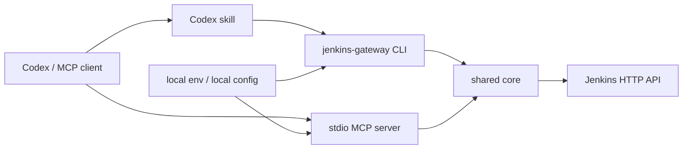

# Jenkins Gateway MCP User Manual

[README](../README.md) | [中文使用手册](manual.zh.md)

## 1. Overview

Jenkins Gateway MCP is a local gateway for Jenkins HTTP API. It provides:

- A stdio MCP server for Codex and other MCP clients.
- A JSON-oriented CLI for scripts, CI, local debugging, and skills.
- A shared core that contains Jenkins HTTP access, configuration loading, redaction, parameter handling, protected-tool authorization, and workflow orchestration.

The gateway does not require any Jenkins server-side plugin. It only needs a Jenkins user ID, an API token, and network access from the local machine to Jenkins.

The repository must remain private until the project passes new-architecture acceptance and the pre-publication security review. The npm package must not be published before that checkpoint.

## 2. Architecture



Design principles:

- Keep Jenkins account, token, and server URL outside Git-tracked code.
- Keep MCP transport simple with stdio for local tool integration.
- Keep MCP tools discoverable and bounded by schema.
- Put complex workflow logic in CLI/shared core so it can be tested deterministically.
- Keep protected operations denied by default.

## 3. Installation And Deployment

### 3.1 Private Source Checkout

Use source checkout before the package is published to npm.

Windows PowerShell:

```powershell
git clone <private-repo-url>
cd jenkins_gateway
npm install
npm run build

$env:JENKINS_BASE_URL="https://jenkins.example.com/"
$env:JENKINS_USER_ID="replace-with-jenkins-user-id"
$env:JENKINS_API_TOKEN="<jenkins-api-token>"
$env:JENKINS_MCP_ENABLE_PROTECTED_TOOLS="false"

node dist/cli.js server info --json
node dist/cli.js mcp stdio
```

macOS / Linux:

```bash
git clone <private-repo-url>
cd jenkins_gateway
npm install
npm run build

export JENKINS_BASE_URL="https://jenkins.example.com/"
export JENKINS_USER_ID="replace-with-jenkins-user-id"
export JENKINS_API_TOKEN="<jenkins-api-token>"
export JENKINS_MCP_ENABLE_PROTECTED_TOOLS="false"

node dist/cli.js server info --json
node dist/cli.js mcp stdio
```

### 3.2 Future npx Deployment

After the repository becomes public and the npm package is published:

```powershell
# Windows PowerShell
$env:JENKINS_BASE_URL="https://jenkins.example.com/"
$env:JENKINS_USER_ID="replace-with-jenkins-user-id"
$env:JENKINS_API_TOKEN="<jenkins-api-token>"
npx -y jenkins-gateway-mcp mcp stdio
```

```bash
# macOS / Linux
export JENKINS_BASE_URL="https://jenkins.example.com/"
export JENKINS_USER_ID="replace-with-jenkins-user-id"
export JENKINS_API_TOKEN="<jenkins-api-token>"
npx -y jenkins-gateway-mcp mcp stdio
```

If the final npm package uses a scoped name, replace `jenkins-gateway-mcp` with the scoped package name.

## 4. Configuration

Required variables:

| Variable | Required | Default | Description |
| --- | --- | --- | --- |
| `JENKINS_BASE_URL` | yes | none | Jenkins root URL, for example `https://jenkins.example.com/`. |
| `JENKINS_USER_ID` | yes | none | Jenkins user ID. |
| `JENKINS_API_TOKEN` | yes | none | Jenkins API token. |

Optional variables:

| Variable | Default | Description |
| --- | --- | --- |
| `JENKINS_MCP_PROFILE` | `default` | Local profile label for diagnostics. |
| `JENKINS_MCP_ENABLE_PROTECTED_TOOLS` | `false` | Master switch for protected tools. |
| `JENKINS_MCP_PROTECTED_ALLOW_ALL` | `false` | Allow protected tools for every job unless a narrower deny rule matches. |
| `JENKINS_MCP_PROTECTED_VIEW_ALLOWLIST` | empty | Comma-separated Jenkins views allowed to use protected tools. |
| `JENKINS_MCP_PROTECTED_VIEW_DENYLIST` | empty | Comma-separated Jenkins views denied from protected tools. |
| `JENKINS_MCP_PROTECTED_JOB_ALLOWLIST` | empty | Comma-separated Jenkins job paths allowed to use protected tools. |
| `JENKINS_MCP_PROTECTED_JOB_DENYLIST` | empty | Comma-separated Jenkins job paths denied from protected tools. |
| `JENKINS_MCP_REQUEST_TIMEOUT_MS` | `30000` | Jenkins API request timeout. |
| `JENKINS_MCP_CONSOLE_LOG_MAX_BYTES` | `65536` | Default maximum console log bytes per call. |
| `JENKINS_MCP_LOG_LEVEL` | `info` | Log level. |

Local files such as `.env.local` and `.codex/config.toml` are ignored and must stay untracked.

## 5. Codex MCP Configuration

Private source checkout:

```toml
[mcp_servers.jenkins]
command = "node"
args = ["D:/path/to/jenkins_gateway/dist/cli.js", "mcp", "stdio"]

[mcp_servers.jenkins.env]
JENKINS_MCP_PROFILE = "example"
JENKINS_BASE_URL = "https://jenkins.example.com/"
JENKINS_USER_ID = "replace-with-jenkins-user-id"
JENKINS_API_TOKEN = "<jenkins-api-token>"
JENKINS_MCP_ENABLE_PROTECTED_TOOLS = "false"
JENKINS_MCP_PROTECTED_ALLOW_ALL = "false"
```

Future npm package:

```toml
[mcp_servers.jenkins]
command = "npx"
args = ["-y", "jenkins-gateway-mcp", "mcp", "stdio"]

[mcp_servers.jenkins.env]
JENKINS_MCP_PROFILE = "example"
JENKINS_BASE_URL = "https://jenkins.example.com/"
JENKINS_USER_ID = "replace-with-jenkins-user-id"
JENKINS_API_TOKEN = "<jenkins-api-token>"
JENKINS_MCP_ENABLE_PROTECTED_TOOLS = "false"
JENKINS_MCP_PROTECTED_ALLOW_ALL = "false"
```

For protected write access, enable the master switch and add explicit allow rules:

```toml
[mcp_servers.jenkins.env]
JENKINS_MCP_ENABLE_PROTECTED_TOOLS = "true"
JENKINS_MCP_PROTECTED_ALLOW_ALL = "false"
JENKINS_MCP_PROTECTED_VIEW_ALLOWLIST = "example-release-view,example-stage-view"
JENKINS_MCP_PROTECTED_JOB_DENYLIST = "example-danger-job"
```

## 6. CLI Reference

All commands write JSON to stdout. Errors are written to stderr.

Start MCP server:

```bash
jenkins-gateway mcp stdio
jenkins-gateway-mcp mcp stdio
```

Server probe:

```bash
jenkins-gateway server info --json
```

Views:

```bash
jenkins-gateway view list --json
jenkins-gateway view get "example-release-view" --json
```

Jobs:

```bash
jenkins-gateway job list --json
jenkins-gateway job list --folder "folder-a" --json
jenkins-gateway job list --view "example-release-view" --json
jenkins-gateway job get "folder-a/job-name" --json
jenkins-gateway job params "example-upgrade-job" --json
```

Build trigger:

```bash
jenkins-gateway build trigger "example-job" --json
jenkins-gateway build trigger "example-upgrade-job" --param serviceList=example-component --json
```

Build trigger is a protected operation. It is denied unless protected-tool settings allow the target job.

Workflow:

```bash
jenkins-gateway workflow upgrade-component \
  --compile-job "example-front-release-build" \
  --upgrade-job "example-release-upgrade-job" \
  --component "example-front-release-component" \
  --wait \
  --json
```

The workflow checks the compile build, validates the upgrade job parameter value, triggers the upgrade job, optionally waits for queue/build completion, and prints a JSON summary.

## 7. MCP Tools

| Tool | Type | Description |
| --- | --- | --- |
| `jenkins.get_server_info` | read-only | Probe Jenkins connectivity and authenticated user state. |
| `jenkins.list_views` | read-only | List Jenkins views visible to the configured account. |
| `jenkins.get_view` | read-only | Get view metadata and jobs. |
| `jenkins.list_jobs` | read-only | List jobs at root or under a folder. |
| `jenkins.get_job` | read-only | Get job metadata, parameter definitions, and recent build pointers. |
| `jenkins.get_build_parameters` | read-only | Get build parameter definitions and known choices. |
| `jenkins.get_build` | read-only | Get build status and metadata. |
| `jenkins.get_queue_item` | read-only | Get queue item state. |
| `jenkins.get_console_log` | protected read | Read progressive console output. Not redacted. Size-limited. |
| `jenkins.trigger_build` | protected write | Trigger a Jenkins build. |
| `jenkins.stop_build` | protected write | Stop a Jenkins build. |

## 8. Protected Tool Rules

Protected tools are:

- `jenkins.get_console_log`
- `jenkins.trigger_build`
- `jenkins.stop_build`

Authorization order:

1. If `JENKINS_MCP_ENABLE_PROTECTED_TOOLS=false`, deny.
2. If the job matches `JENKINS_MCP_PROTECTED_JOB_DENYLIST`, deny.
3. If the job matches `JENKINS_MCP_PROTECTED_JOB_ALLOWLIST`, allow.
4. If the job belongs to any view in `JENKINS_MCP_PROTECTED_VIEW_DENYLIST`, deny.
5. If the job belongs to any view in `JENKINS_MCP_PROTECTED_VIEW_ALLOWLIST`, allow.
6. If `JENKINS_MCP_PROTECTED_ALLOW_ALL=true`, allow.
7. Otherwise deny.

This means:

- Job rules override view rules.
- View rules override allow-all.
- Deny wins over allow at the same level.
- A job appearing in multiple views is denied if any matching same-level view deny rule applies, unless a job-level allow rule overrides it.

Console log is protected even though it is a read operation because console output may contain secrets. The gateway does not redact console content, but it limits response size.

## 9. Jenkins API Details

Authentication uses Jenkins Basic Auth:

- username: `JENKINS_USER_ID`
- password: `JENKINS_API_TOKEN`

For POST operations, the gateway requests `/crumbIssuer/api/json` and sends the returned crumb header when required.

Jenkins folder paths use logical slash-separated paths such as:

```text
folder-a/folder-b/job-name
```

The gateway converts that form to Jenkins URL segments:

```text
/job/folder-a/job/folder-b/job/job-name
```

Each path segment is encoded independently, so spaces, non-ASCII names, and folder separators remain unambiguous.

## 10. Parameter Handling

`job params` and `jenkins.get_build_parameters` read parameters from the Jenkins job API. For parameters without choices, the gateway also tries to read the Jenkins build page to extract choices, including Extended Choice checkbox values.

If the build page returns `404` or `405`, the gateway falls back to the job API parameter definitions. Authentication failures and server errors are still reported.

Before a parameterized trigger, known choice values are validated. Invalid values are rejected before sending Jenkins POST.

## 11. Security And Logging

- Do not commit `.env.local`, `.codex/config.toml`, API tokens, crumbs, authorization headers, or full console logs.
- Normal structured outputs redact configured API tokens.
- MCP stdout is reserved for protocol traffic; logs must go to stderr.
- Write operations are never retried automatically after failure.
- Console log content is not redacted and should be treated as protected data.
- If a Jenkins token is ever copied into Git history, screenshots, logs, issue text, or public chat, rotate it immediately.

## 12. Testing Gates

Before moving to the next implementation or release stage, run:

```bash
npm run typecheck
npm run build
npm test
npm pack --dry-run --ignore-scripts
```

The package dry run must not include:

- `.env.local`
- `.codex/config.toml`
- local logs
- npm tokens
- Jenkins API tokens
- test fixtures or local temporary outputs

## 13. Release Policy

Private validation:

- Keep the GitHub repository private.
- Keep `package.json` as `"private": true`.
- Do not publish to npm.
- Use source checkout for local and Codex validation.

Public release:

1. Finish new-architecture acceptance.
2. Finish pre-publication security scan over current files and Git history.
3. Confirm package contents with `npm pack --dry-run --ignore-scripts`.
4. Convert GitHub repository from private to public.
5. Publish the npm package through a controlled release workflow.
6. Validate `npx -y jenkins-gateway-mcp mcp stdio` in a clean Windows and macOS/Linux environment.

## 14. Troubleshooting

`JENKINS_BASE_URL is required`

: Set `JENKINS_BASE_URL`, `JENKINS_USER_ID`, and `JENKINS_API_TOKEN` in the environment used to start the CLI or MCP server.

`protected-tools-disabled`

: The requested operation is protected. Set `JENKINS_MCP_ENABLE_PROTECTED_TOOLS=true` and add an allow rule for the target job or view.

`Invalid Jenkins parameter value`

: The submitted value is not in the known Jenkins choices. Run `jenkins-gateway job params "<job>" --json` first.

`405 Method Not Allowed` while reading build parameters

: Newer gateway builds fall back to the Jenkins job API when the build page refuses GET requests. Rebuild from source and restart the MCP process if an old Codex MCP subprocess is still running.
