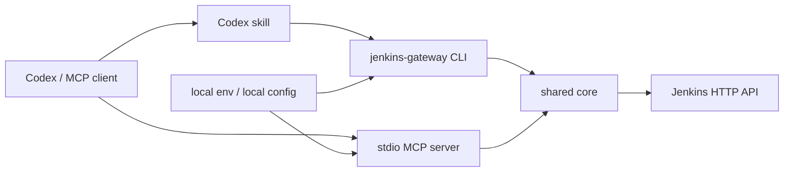

# Jenkins Gateway User Manual

[README](../README.md) | [中文使用手册](manual.zh.md)

## 1. Overview

Jenkins Gateway is a local gateway for Jenkins HTTP API. It provides:

- A stdio MCP server for Codex and other MCP clients.
- A JSON-oriented CLI for scripts, CI, local debugging, and skills.
- A shared core that contains Jenkins HTTP access, configuration loading, redaction, parameter handling, protected-tool authorization, and workflow orchestration.

The gateway does not require any Jenkins server-side plugin. It only needs a Jenkins user ID, an API token, and network access from the local machine to Jenkins.

## 2. Architecture



Design principles:

- Load Jenkins account, token, and server URL from runtime configuration.
- Keep MCP transport simple with stdio for local tool integration.
- Keep MCP tools discoverable and bounded by schema.
- Put complex workflow logic in CLI/shared core so it can be tested deterministically.
- Keep protected operations denied by default.

## 3. Installation And Deployment

### 3.1 Source Checkout

Windows PowerShell:

```powershell
git clone <repo-url>
cd jenkins_gateway
npm install
npm run build

$env:JENKINS_BASE_URL="https://jenkins.example.com/"
$env:JENKINS_USER_ID="replace-with-jenkins-user-id"
$env:JENKINS_API_TOKEN="<jenkins-api-token>"
$env:JENKINS_MCP_ENABLE_PROTECTED_TOOLS="false"

node dist/cli.js server info --json
node dist/cli.js mcp stdio
```

macOS / Linux:

```bash
git clone <repo-url>
cd jenkins_gateway
npm install
npm run build

export JENKINS_BASE_URL="https://jenkins.example.com/"
export JENKINS_USER_ID="replace-with-jenkins-user-id"
export JENKINS_API_TOKEN="<jenkins-api-token>"
export JENKINS_MCP_ENABLE_PROTECTED_TOOLS="false"

node dist/cli.js server info --json
node dist/cli.js mcp stdio
```

### 3.2 npx Package

```powershell
# Windows PowerShell
$env:JENKINS_BASE_URL="https://jenkins.example.com/"
$env:JENKINS_USER_ID="replace-with-jenkins-user-id"
$env:JENKINS_API_TOKEN="<jenkins-api-token>"
npx -y jenkins-gateway mcp stdio
```

```bash
# macOS / Linux
export JENKINS_BASE_URL="https://jenkins.example.com/"
export JENKINS_USER_ID="replace-with-jenkins-user-id"
export JENKINS_API_TOKEN="<jenkins-api-token>"
npx -y jenkins-gateway mcp stdio
```

## 4. Configuration

Required variables:

| Variable | Required | Default | Description |
| --- | --- | --- | --- |
| `JENKINS_BASE_URL` | yes | none | Jenkins root URL, for example `https://jenkins.example.com/`. |
| `JENKINS_USER_ID` | yes | none | Jenkins user ID. |
| `JENKINS_API_TOKEN` | yes | none | Jenkins API token. |

Optional variables:

| Variable | Default | Description |
| --- | --- | --- |
| `JENKINS_MCP_PROFILE` | `default` | Local profile label for diagnostics. |
| `JENKINS_MCP_ENABLE_PROTECTED_TOOLS` | `false` | Master switch for protected tools. |
| `JENKINS_MCP_PROTECTED_ALLOW_ALL` | `false` | Allow protected tools for every job unless a narrower deny rule matches. |
| `JENKINS_MCP_PROTECTED_VIEW_ALLOWLIST` | empty | Comma-separated Jenkins views allowed to use protected tools. |
| `JENKINS_MCP_PROTECTED_VIEW_DENYLIST` | empty | Comma-separated Jenkins views denied from protected tools. |
| `JENKINS_MCP_PROTECTED_JOB_ALLOWLIST` | empty | Comma-separated Jenkins job paths allowed to use protected tools. |
| `JENKINS_MCP_PROTECTED_JOB_DENYLIST` | empty | Comma-separated Jenkins job paths denied from protected tools. |
| `JENKINS_MCP_REQUEST_TIMEOUT_MS` | `30000` | Jenkins API request timeout. |
| `JENKINS_MCP_CONSOLE_LOG_MAX_BYTES` | `65536` | Default maximum console log bytes per call. |
| `JENKINS_MCP_LOG_LEVEL` | `info` | Log level. |

Choose a local configuration method for credentials, such as shell environment variables or the MCP client's environment block.

## 5. MCP Client Configuration

MCP mode is for agent clients that support the Model Context Protocol. It exposes Jenkins tools to the client, but it does not install the bundled CLI skill or make the shell command globally available.

Platform references: [Claude Code MCP](https://code.claude.com/docs/en/mcp), [Cursor MCP](https://cursor.com/docs/mcp), and [VS Code MCP](https://code.visualstudio.com/docs/agent-customization/mcp-servers).

The recommended stdio server command is:

```bash
npx -y jenkins-gateway mcp stdio
```

### 5.1 Codex

Configure Codex with a local MCP server entry.

Source checkout:

```toml
[mcp_servers.jenkins]
command = "node"
args = ["D:/path/to/jenkins_gateway/dist/cli.js", "mcp", "stdio"]

[mcp_servers.jenkins.env]
JENKINS_MCP_PROFILE = "example"
JENKINS_BASE_URL = "https://jenkins.example.com/"
JENKINS_USER_ID = "replace-with-jenkins-user-id"
JENKINS_API_TOKEN = "<jenkins-api-token>"
JENKINS_MCP_ENABLE_PROTECTED_TOOLS = "false"
JENKINS_MCP_PROTECTED_ALLOW_ALL = "false"
```

npx package:

```toml
[mcp_servers.jenkins]
command = "npx"
args = ["-y", "jenkins-gateway", "mcp", "stdio"]

[mcp_servers.jenkins.env]
JENKINS_MCP_PROFILE = "example"
JENKINS_BASE_URL = "https://jenkins.example.com/"
JENKINS_USER_ID = "replace-with-jenkins-user-id"
JENKINS_API_TOKEN = "<jenkins-api-token>"
JENKINS_MCP_ENABLE_PROTECTED_TOOLS = "false"
JENKINS_MCP_PROTECTED_ALLOW_ALL = "false"
```

### 5.2 Claude Code

Claude Code can add local stdio MCP servers with `claude mcp add` or a project/user `.mcp.json` file.

CLI example:

```bash
claude mcp add \
  --env JENKINS_MCP_PROFILE=example \
  --env JENKINS_BASE_URL=https://jenkins.example.com/ \
  --env JENKINS_USER_ID=replace-with-jenkins-user-id \
  --env JENKINS_API_TOKEN=<jenkins-api-token> \
  --env JENKINS_MCP_ENABLE_PROTECTED_TOOLS=false \
  --transport stdio \
  jenkins-gateway -- npx -y jenkins-gateway mcp stdio
```

Shared `.mcp.json` example:

```json
{
  "mcpServers": {
    "jenkins-gateway": {
      "type": "stdio",
      "command": "npx",
      "args": ["-y", "jenkins-gateway", "mcp", "stdio"],
      "env": {
        "JENKINS_MCP_PROFILE": "example",
        "JENKINS_BASE_URL": "https://jenkins.example.com/",
        "JENKINS_USER_ID": "replace-with-jenkins-user-id",
        "JENKINS_API_TOKEN": "<jenkins-api-token>",
        "JENKINS_MCP_ENABLE_PROTECTED_TOOLS": "false"
      }
    }
  }
}
```

### 5.3 Cursor

Cursor supports project-level `.cursor/mcp.json` and user-level `~/.cursor/mcp.json` files.

```json
{
  "mcpServers": {
    "jenkins-gateway": {
      "type": "stdio",
      "command": "npx",
      "args": ["-y", "jenkins-gateway", "mcp", "stdio"],
      "env": {
        "JENKINS_MCP_PROFILE": "example",
        "JENKINS_BASE_URL": "https://jenkins.example.com/",
        "JENKINS_USER_ID": "replace-with-jenkins-user-id",
        "JENKINS_API_TOKEN": "<jenkins-api-token>",
        "JENKINS_MCP_ENABLE_PROTECTED_TOOLS": "false"
      }
    }
  }
}
```

### 5.4 VS Code

VS Code uses `mcp.json` files. For a workspace configuration, create `.vscode/mcp.json`. For a user configuration, use the MCP: Open User Configuration command.

```json
{
  "servers": {
    "jenkins-gateway": {
      "type": "stdio",
      "command": "npx",
      "args": ["-y", "jenkins-gateway", "mcp", "stdio"],
      "env": {
        "JENKINS_MCP_PROFILE": "example",
        "JENKINS_BASE_URL": "https://jenkins.example.com/",
        "JENKINS_USER_ID": "replace-with-jenkins-user-id",
        "JENKINS_API_TOKEN": "<jenkins-api-token>",
        "JENKINS_MCP_ENABLE_PROTECTED_TOOLS": "false"
      }
    }
  }
}
```

### 5.5 Protected MCP Access

For protected write access, enable the master switch and add explicit allow rules:

```toml
[mcp_servers.jenkins.env]
JENKINS_MCP_ENABLE_PROTECTED_TOOLS = "true"
JENKINS_MCP_PROTECTED_ALLOW_ALL = "false"
JENKINS_MCP_PROTECTED_VIEW_ALLOWLIST = "example-release-view,example-stage-view"
JENKINS_MCP_PROTECTED_JOB_DENYLIST = "example-danger-job"
```

Use the same environment variables in JSON-based clients:

```json
{
  "JENKINS_MCP_ENABLE_PROTECTED_TOOLS": "true",
  "JENKINS_MCP_PROTECTED_ALLOW_ALL": "false",
  "JENKINS_MCP_PROTECTED_VIEW_ALLOWLIST": "example-release-view,example-stage-view",
  "JENKINS_MCP_PROTECTED_JOB_DENYLIST": "example-danger-job"
}
```

## 6. CLI And Skill Configuration

CLI mode is separate from MCP mode. It is for shells, scripts, CI jobs, and agent platforms that can run terminal commands. It does not require MCP client configuration.

### 6.1 Direct CLI Usage

Use either a global install:

```bash
npm install -g jenkins-gateway
jenkins-gateway server info --json
```

Or run through npx:

```bash
JENKINS_BASE_URL="https://jenkins.example.com/" \
JENKINS_USER_ID="replace-with-jenkins-user-id" \
JENKINS_API_TOKEN="<jenkins-api-token>" \
npx -y jenkins-gateway server info --json
```

On Windows PowerShell:

```powershell
$env:JENKINS_BASE_URL="https://jenkins.example.com/"
$env:JENKINS_USER_ID="replace-with-jenkins-user-id"
$env:JENKINS_API_TOKEN="<jenkins-api-token>"
npx -y jenkins-gateway server info --json
```

### 6.2 Agent Skill Installation

Installing or mounting the MCP server does not automatically install the bundled `jenkins-workflow` skill in Codex, Claude Code, Cursor, VS Code, or other agent platforms. MCP tools and agent skills are separate integration layers.

This package includes a portable skill at `skills/jenkins-workflow/`. The recommended installation path is the bundled installer:

```bash
npx -y jenkins-gateway skill install jenkins-workflow --platform codex --scope project
```

The installer copies the bundled skill to the target platform's skill root. It does not modify Jenkins credentials, MCP client configuration, or shell startup files.

Common installer commands:

| Platform | Project-level command | User-level command |
| --- | --- | --- |
| Codex | `npx -y jenkins-gateway skill install jenkins-workflow --platform codex --scope project` | `npx -y jenkins-gateway skill install jenkins-workflow --platform codex --scope user` |
| Claude Code | `npx -y jenkins-gateway skill install jenkins-workflow --platform claude --scope project` | `npx -y jenkins-gateway skill install jenkins-workflow --platform claude --scope user` |
| Cursor | `npx -y jenkins-gateway skill install jenkins-workflow --platform cursor --scope project` | `npx -y jenkins-gateway skill install jenkins-workflow --platform cursor --scope user` |
| VS Code / GitHub Copilot | `npx -y jenkins-gateway skill install jenkins-workflow --platform vscode --scope project` | `npx -y jenkins-gateway skill install jenkins-workflow --platform vscode --scope user` |

Installer options:

```bash
jenkins-gateway skill list --json
jenkins-gateway skill install jenkins-workflow --platform codex --scope project --dry-run --json
jenkins-gateway skill install jenkins-workflow --platform codex --scope project --force --json
jenkins-gateway skill install jenkins-workflow --target .agents/skills --json
```

`--target` overrides the platform default and points to the parent skill root; the installer creates `<target>/jenkins-workflow/`.

Platform references: [Codex Agent Skills](https://developers.openai.com/codex/skills), [Claude Code skills](https://code.claude.com/docs/en/skills), [Cursor skills](https://cursor.com/docs/skills), and [VS Code Agent Skills](https://code.visualstudio.com/docs/agent-customization/agent-skills).

Common locations:

| Platform | Project-level skill location | User-level skill location |
| --- | --- | --- |
| Codex | `.agents/skills/jenkins-workflow/` | `~/.agents/skills/jenkins-workflow/` |
| Claude Code | `.claude/skills/jenkins-workflow/` | `~/.claude/skills/jenkins-workflow/` |
| Cursor | `.cursor/skills/jenkins-workflow/` | `~/.cursor/skills/jenkins-workflow/` |
| VS Code / GitHub Copilot | `.github/skills/jenkins-workflow/` | `~/.copilot/skills/jenkins-workflow/` |

The skill guides agents to use the CLI safely. It does not grant Jenkins access by itself; credentials and protected-tool authorization still come from local environment variables or MCP/CLI configuration.

The bundled skill is configured with `disable-model-invocation: true`, so skills-compatible clients should treat it as an explicit workflow skill. In Codex, invoke it explicitly with `$jenkins-workflow` or inspect available skills with `/skills`. In clients that support slash-command skills, use `/jenkins-workflow`. Remove or change that frontmatter field only if you want the agent to auto-load the skill based on conversation relevance.

## 7. CLI Reference

All commands write JSON to stdout. Errors are written to stderr.

Skill installer:

```bash
jenkins-gateway skill list --json
jenkins-gateway skill install jenkins-workflow --platform codex --scope project --json
jenkins-gateway skill install jenkins-workflow --platform codex --scope user --json
```

Server probe:

```bash
jenkins-gateway server info --json
```

Views:

```bash
jenkins-gateway view list --json
jenkins-gateway view get "example-release-view" --json
```

Jobs:

```bash
jenkins-gateway job list --json
jenkins-gateway job list --folder "folder-a" --json
jenkins-gateway job list --view "example-release-view" --json
jenkins-gateway job get "folder-a/job-name" --json
jenkins-gateway job params "example-upgrade-job" --json
```

Build trigger:

```bash
jenkins-gateway build trigger "example-job" --json
jenkins-gateway build trigger "example-upgrade-job" --param serviceList=example-component --json
jenkins-gateway build trigger "example-upgrade-job" \
  --param serviceList=example-component \
  --verify-parameters \
  --json
jenkins-gateway build get "example-job" 123 --json
jenkins-gateway build wait "example-job" 123 --json
```

Build trigger is a protected operation. It is denied unless protected-tool settings allow the target job.
Use `--verify-parameters` for parameterized jobs that must prove submitted values landed in the executable build.
Use repeated `--param name=value` or `--param-json '{"name":["a","b"]}'` for multi-value parameters.

Queue:

```bash
jenkins-gateway queue get 123 --json
jenkins-gateway queue wait 123 --json
```

Workflow:

```bash
jenkins-gateway workflow upgrade-component \
  --compile-job "example-front-release-build" \
  --upgrade-job "example-release-upgrade-job" \
  --component "example-front-release-component" \
  --wait \
  --json
```

The workflow checks the compile build, validates the upgrade job parameter value, triggers the upgrade job, optionally waits for queue/build completion, and prints a JSON summary.

## 8. MCP Tools

| Tool | Type | Description |
| --- | --- | --- |
| `jenkins.get_server_info` | read-only | Probe Jenkins connectivity and authenticated user state. |
| `jenkins.list_views` | read-only | List Jenkins views visible to the configured account. |
| `jenkins.get_view` | read-only | Get view metadata and jobs. |
| `jenkins.list_jobs` | read-only | List jobs at root or under a folder. |
| `jenkins.get_job` | read-only | Get job metadata, parameter definitions, and recent build pointers. |
| `jenkins.get_build_parameters` | read-only | Get build parameter definitions and known choices. |
| `jenkins.get_build` | read-only | Get build status and metadata. |
| `jenkins.get_queue_item` | read-only | Get queue item state. |
| `jenkins.get_console_log` | protected read | Read progressive console output. Not redacted. Size-limited. |
| `jenkins.trigger_build` | protected write | Trigger a Jenkins build. |
| `jenkins.stop_build` | protected write | Stop a Jenkins build. |

## 9. Protected Tool Rules

Protected tools are:

- `jenkins.get_console_log`
- `jenkins.trigger_build`
- `jenkins.stop_build`

Authorization order:

1. If `JENKINS_MCP_ENABLE_PROTECTED_TOOLS=false`, deny.
2. If the job matches `JENKINS_MCP_PROTECTED_JOB_DENYLIST`, deny.
3. If the job matches `JENKINS_MCP_PROTECTED_JOB_ALLOWLIST`, allow.
4. If the job belongs to any view in `JENKINS_MCP_PROTECTED_VIEW_DENYLIST`, deny.
5. If the job belongs to any view in `JENKINS_MCP_PROTECTED_VIEW_ALLOWLIST`, allow.
6. If `JENKINS_MCP_PROTECTED_ALLOW_ALL=true`, allow.
7. Otherwise deny.

This means:

- Job rules override view rules.
- View rules override allow-all.
- Deny wins over allow at the same level.
- A job appearing in multiple views is denied if any matching same-level view deny rule applies, unless a job-level allow rule overrides it.

Console log is protected even though it is a read operation because console output may contain secrets. The gateway does not redact console content, but it limits response size.

## 10. Jenkins API Details

Authentication uses Jenkins Basic Auth:

- username: `JENKINS_USER_ID`
- password: `JENKINS_API_TOKEN`

For POST operations, the gateway requests `/crumbIssuer/api/json` and sends the returned crumb header when required.

Jenkins folder paths use logical slash-separated paths such as:

```text
folder-a/folder-b/job-name
```

The gateway converts that form to Jenkins URL segments:

```text
/job/folder-a/job/folder-b/job/job-name
```

Each path segment is encoded independently, so spaces, non-ASCII names, and folder separators remain unambiguous.

## 11. Parameter Handling

`job params` and `jenkins.get_build_parameters` read parameters from the Jenkins job API. For Extended Choice parameters, the gateway first tries Jenkins job API fields such as `value` and `multiSelectDelimiter`; when choices are still missing, it also tries to read the Jenkins build page to extract checkbox and option values.

If the build page returns `404` or `405`, the gateway falls back to the job API parameter definitions and returns `choicesUnavailableReason`. Authentication failures and server errors are still reported.

Before a parameterized trigger, known choice values are validated. Invalid values are rejected before sending Jenkins POST.

Parameterized trigger defaults to `--submit-mode auto`. Auto mode uses normal `buildWithParameters` for ordinary parameters and Jenkins form-compatible submission for Extended Choice checkbox parameters. You can force `--submit-mode urlencoded` or `--submit-mode jenkins-form` when diagnosing Jenkins plugin behavior.

`--verify-parameters` waits for the queue item to expose an executable build, reads `actions[].parameters[]`, and fails if submitted values are missing, empty, or different.

## 12. Security And Logging

- Store Jenkins credentials in environment variables or local MCP client configuration.
- Normal structured outputs redact configured API tokens.
- MCP stdout is reserved for protocol traffic; logs must go to stderr.
- Write operations are never retried automatically after failure.
- Console log content is not redacted and should be treated as protected data.
- Rotate a Jenkins token if it is exposed in screenshots, logs, issue text, or chat.

## 13. Troubleshooting

`JENKINS_BASE_URL is required`

: Set `JENKINS_BASE_URL`, `JENKINS_USER_ID`, and `JENKINS_API_TOKEN` in the environment used to start the CLI or MCP server.

`protected-tools-disabled`

: The requested operation is protected. Set `JENKINS_MCP_ENABLE_PROTECTED_TOOLS=true` and add an allow rule for the target job or view.

`Invalid Jenkins parameter value`

: The submitted value is not in the known Jenkins choices. Run `jenkins-gateway job params "<job>" --json` first.

`Jenkins build parameter verification failed`

: Jenkins accepted the queue item, but the executable build did not contain the submitted parameter values. Retry with `--submit-mode jenkins-form`, inspect `jenkins-gateway build get "<job>" <build> --json`, and compare the job's `job params` output with the Jenkins build form.

`405 Method Not Allowed` while reading build parameters

: Newer gateway builds fall back to the Jenkins job API when the build page refuses GET requests. Rebuild from source and restart the MCP process if an old Codex MCP subprocess is still running.
