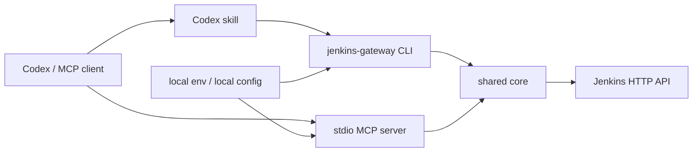

# Jenkins Gateway 使用手册

[README](../README.md) | [User Manual](manual.en.md)

## 1. 项目概览

Jenkins Gateway 是一个面向 Jenkins HTTP API 的本地网关，提供：

- 面向 Codex 和其他 MCP 客户端的 stdio MCP server。
- 面向脚本、CI、本地调试和 skill 的 JSON CLI。
- 共享 core，用于 Jenkins HTTP 访问、配置加载、脱敏、参数处理、受保护工具授权和工作流编排。

该方案不需要在 Jenkins 服务器端安装 MCP 插件，只要求本机具备 Jenkins 用户 ID、API token 和到 Jenkins 的网络访问。

## 2. 架构



设计原则：

- Jenkins 账号、token、服务器地址从运行时配置读取。
- MCP transport 优先使用 stdio，便于本地工具装载。
- MCP tools 保持可发现、参数结构清晰、权限边界明确。
- 复杂工作流放入 CLI/shared core，便于测试和复用。
- 受保护操作默认拒绝，必须显式授权。

## 3. 安装与部署

### 3.1 源码部署

Windows PowerShell：

```powershell
git clone <repo-url>
cd jenkins_gateway
npm install
npm run build

$env:JENKINS_BASE_URL="https://jenkins.example.com/"
$env:JENKINS_USER_ID="replace-with-jenkins-user-id"
$env:JENKINS_API_TOKEN="<jenkins-api-token>"
$env:JENKINS_MCP_ENABLE_PROTECTED_TOOLS="false"

node dist/cli.js server info --json
node dist/cli.js mcp stdio
```

macOS / Linux：

```bash
git clone <repo-url>
cd jenkins_gateway
npm install
npm run build

export JENKINS_BASE_URL="https://jenkins.example.com/"
export JENKINS_USER_ID="replace-with-jenkins-user-id"
export JENKINS_API_TOKEN="<jenkins-api-token>"
export JENKINS_MCP_ENABLE_PROTECTED_TOOLS="false"

node dist/cli.js server info --json
node dist/cli.js mcp stdio
```

### 3.2 npx 包部署

```powershell
# Windows PowerShell
$env:JENKINS_BASE_URL="https://jenkins.example.com/"
$env:JENKINS_USER_ID="replace-with-jenkins-user-id"
$env:JENKINS_API_TOKEN="<jenkins-api-token>"
npx -y jenkins-gateway mcp stdio
```

```bash
# macOS / Linux
export JENKINS_BASE_URL="https://jenkins.example.com/"
export JENKINS_USER_ID="replace-with-jenkins-user-id"
export JENKINS_API_TOKEN="<jenkins-api-token>"
npx -y jenkins-gateway mcp stdio
```

## 4. 配置

必填变量：

| 变量 | 必填 | 默认值 | 说明 |
| --- | --- | --- | --- |
| `JENKINS_BASE_URL` | 是 | 无 | Jenkins 根地址，例如 `https://jenkins.example.com/`。 |
| `JENKINS_USER_ID` | 是 | 无 | Jenkins 用户 ID。 |
| `JENKINS_API_TOKEN` | 是 | 无 | Jenkins API token。 |

可选变量：

| 变量 | 默认值 | 说明 |
| --- | --- | --- |
| `JENKINS_MCP_PROFILE` | `default` | 本地 profile 名称，用于诊断。 |
| `JENKINS_MCP_ENABLE_PROTECTED_TOOLS` | `false` | 受保护工具主开关。 |
| `JENKINS_MCP_PROTECTED_ALLOW_ALL` | `false` | 允许所有 job 使用受保护工具，除非命中更细粒度 deny。 |
| `JENKINS_MCP_PROTECTED_VIEW_ALLOWLIST` | 空 | 允许使用受保护工具的 Jenkins view，逗号分隔。 |
| `JENKINS_MCP_PROTECTED_VIEW_DENYLIST` | 空 | 禁止使用受保护工具的 Jenkins view，逗号分隔。 |
| `JENKINS_MCP_PROTECTED_JOB_ALLOWLIST` | 空 | 允许使用受保护工具的 job path，逗号分隔。 |
| `JENKINS_MCP_PROTECTED_JOB_DENYLIST` | 空 | 禁止使用受保护工具的 job path，逗号分隔。 |
| `JENKINS_MCP_REQUEST_TIMEOUT_MS` | `30000` | Jenkins API 请求超时时间。 |
| `JENKINS_MCP_CONSOLE_LOG_MAX_BYTES` | `65536` | 单次 console log 默认最大返回字节数。 |
| `JENKINS_MCP_LOG_LEVEL` | `info` | 日志级别。 |

可以选择一种本机配置方式提供凭据，例如 shell 环境变量或 MCP 客户端的环境变量块。

## 5. Codex MCP 配置

源码部署：

```toml
[mcp_servers.jenkins]
command = "node"
args = ["D:/path/to/jenkins_gateway/dist/cli.js", "mcp", "stdio"]

[mcp_servers.jenkins.env]
JENKINS_MCP_PROFILE = "example"
JENKINS_BASE_URL = "https://jenkins.example.com/"
JENKINS_USER_ID = "replace-with-jenkins-user-id"
JENKINS_API_TOKEN = "<jenkins-api-token>"
JENKINS_MCP_ENABLE_PROTECTED_TOOLS = "false"
JENKINS_MCP_PROTECTED_ALLOW_ALL = "false"
```

npx 包：

```toml
[mcp_servers.jenkins]
command = "npx"
args = ["-y", "jenkins-gateway", "mcp", "stdio"]

[mcp_servers.jenkins.env]
JENKINS_MCP_PROFILE = "example"
JENKINS_BASE_URL = "https://jenkins.example.com/"
JENKINS_USER_ID = "replace-with-jenkins-user-id"
JENKINS_API_TOKEN = "<jenkins-api-token>"
JENKINS_MCP_ENABLE_PROTECTED_TOOLS = "false"
JENKINS_MCP_PROTECTED_ALLOW_ALL = "false"
```

需要开放受保护操作时，必须打开主开关并配置显式 allow：

```toml
[mcp_servers.jenkins.env]
JENKINS_MCP_ENABLE_PROTECTED_TOOLS = "true"
JENKINS_MCP_PROTECTED_ALLOW_ALL = "false"
JENKINS_MCP_PROTECTED_VIEW_ALLOWLIST = "example-release-view,example-stage-view"
JENKINS_MCP_PROTECTED_JOB_DENYLIST = "example-danger-job"
```

## 6. CLI 参考

所有 CLI 命令向 stdout 输出 JSON，错误写入 stderr。

启动 MCP server：

```bash
jenkins-gateway mcp stdio
```

连接探测：

```bash
jenkins-gateway server info --json
```

View：

```bash
jenkins-gateway view list --json
jenkins-gateway view get "example-release-view" --json
```

Job：

```bash
jenkins-gateway job list --json
jenkins-gateway job list --folder "folder-a" --json
jenkins-gateway job list --view "example-release-view" --json
jenkins-gateway job get "folder-a/job-name" --json
jenkins-gateway job params "example-upgrade-job" --json
```

触发构建：

```bash
jenkins-gateway build trigger "example-job" --json
jenkins-gateway build trigger "example-upgrade-job" --param serviceList=example-component --json
```

构建触发属于受保护操作，只有目标 job 命中受保护工具授权规则时才会执行。

工作流：

```bash
jenkins-gateway workflow upgrade-component \
  --compile-job "example-front-release-build" \
  --upgrade-job "example-release-upgrade-job" \
  --component "example-front-release-component" \
  --wait \
  --json
```

该工作流会检查前置编译构建、校验升级 job 参数、触发升级 job，并可等待 queue/build 完成后输出 JSON 摘要。

## 7. MCP Tools

| Tool | 类型 | 说明 |
| --- | --- | --- |
| `jenkins.get_server_info` | 只读 | 探测 Jenkins 连接和认证状态。 |
| `jenkins.list_views` | 只读 | 列出当前账号可见的 Jenkins views。 |
| `jenkins.get_view` | 只读 | 获取 view 元数据和 job 列表。 |
| `jenkins.list_jobs` | 只读 | 列出根目录或 folder 下的 jobs。 |
| `jenkins.get_job` | 只读 | 获取 job 元数据、参数定义和最近构建指针。 |
| `jenkins.get_build_parameters` | 只读 | 获取构建参数定义和已知候选值。 |
| `jenkins.get_build` | 只读 | 获取 build 状态和元数据。 |
| `jenkins.get_queue_item` | 只读 | 获取 queue item 状态。 |
| `jenkins.get_console_log` | 受保护读 | 读取 progressive console 输出；不脱敏，限制大小。 |
| `jenkins.trigger_build` | 受保护写 | 触发 Jenkins 构建。 |
| `jenkins.stop_build` | 受保护写 | 停止 Jenkins 构建。 |

## 8. 受保护工具权限

受保护工具包括：

- `jenkins.get_console_log`
- `jenkins.trigger_build`
- `jenkins.stop_build`

授权判断顺序：

1. `JENKINS_MCP_ENABLE_PROTECTED_TOOLS=false`：拒绝。
2. job 命中 `JENKINS_MCP_PROTECTED_JOB_DENYLIST`：拒绝。
3. job 命中 `JENKINS_MCP_PROTECTED_JOB_ALLOWLIST`：允许。
4. job 所属任一 view 命中 `JENKINS_MCP_PROTECTED_VIEW_DENYLIST`：拒绝。
5. job 所属任一 view 命中 `JENKINS_MCP_PROTECTED_VIEW_ALLOWLIST`：允许。
6. `JENKINS_MCP_PROTECTED_ALLOW_ALL=true`：允许。
7. 其他情况：拒绝。

这意味着：

- job 规则优先于 view 规则。
- view 规则优先于 allow-all。
- 同级冲突时 deny 优先。
- 如果一个 job 出现在多个 view 中，只要命中同级 view deny 即拒绝，除非更高优先级的 job allow 覆盖。

Console log 虽然是读操作，但可能包含敏感信息，因此归入受保护工具。网关不对 console 内容做脱敏，但会限制返回大小。

## 9. Jenkins API 细节

认证使用 Jenkins Basic Auth：

- username：`JENKINS_USER_ID`
- password：`JENKINS_API_TOKEN`

POST 操作会请求 `/crumbIssuer/api/json`，在 Jenkins 要求 CSRF crumb 时自动携带 crumb header。

Jenkins folder 逻辑路径使用 `/` 分隔，例如：

```text
folder-a/folder-b/job-name
```

网关会转换为 Jenkins URL：

```text
/job/folder-a/job/folder-b/job/job-name
```

每个 path segment 单独编码，避免空格、中文和 folder 分隔符混淆。

## 10. 参数处理

`job params` 和 `jenkins.get_build_parameters` 会先从 Jenkins job API 读取参数定义。对于没有 choices 的参数，网关会尝试读取 Jenkins build 页面，以提取包括 Extended Choice checkbox 在内的候选值。

如果 build 页面返回 `404` 或 `405`，网关会退回 job API 已返回的参数定义。认证失败和服务端错误仍会正常报错。

参数化构建触发前会校验已知 choices。非法参数值会在发送 Jenkins POST 之前被拒绝。

## 11. 安全与日志

- Jenkins 凭据通过环境变量或本机 MCP 客户端配置提供。
- 普通结构化输出会对已知 API token 做脱敏。
- MCP stdout 只用于协议流量，日志必须写 stderr。
- 写操作失败后不会自动重放。
- Console log 内容不做脱敏，应按受保护数据处理。
- 如果 Jenkins token 出现在截图、日志、issue 或对话中，应立即轮换。

## 12. 常见问题

`JENKINS_BASE_URL is required`

: 启动 CLI 或 MCP server 的环境中缺少 `JENKINS_BASE_URL`、`JENKINS_USER_ID` 或 `JENKINS_API_TOKEN`。

`protected-tools-disabled`

: 请求的是受保护操作。需要设置 `JENKINS_MCP_ENABLE_PROTECTED_TOOLS=true`，并为目标 job 或 view 配置 allow 规则。

`Invalid Jenkins parameter value`

: 提交的参数值不在已知 Jenkins choices 中。先执行 `jenkins-gateway job params "<job>" --json` 查询参数。

读取构建参数时返回 `405 Method Not Allowed`

: 新版本网关会在 build 页面拒绝 GET 时退回 Jenkins job API。若 Codex 中仍报 405，请重新构建源码并重启 MCP 进程。
