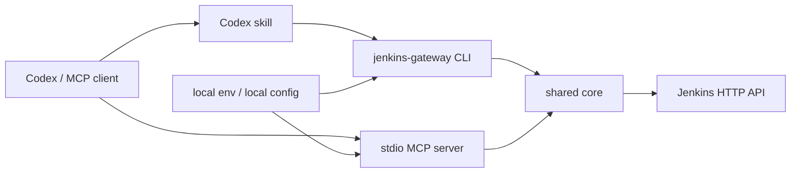

# Jenkins Gateway 使用手册

[中文 README](../README.zh.md) | [English README](../README.md) | [User Manual](manual.en.md)

## 1. 项目概览

Jenkins Gateway 是一个面向 Jenkins HTTP API 的本地网关，提供：

- 面向 Codex 和其他 MCP 客户端的 stdio MCP server。
- 面向脚本、CI、本地调试和 skill 的 JSON CLI。
- 共享 core，用于 Jenkins HTTP 访问、配置加载、脱敏、参数处理、受保护工具授权和工作流编排。

该方案不需要在 Jenkins 服务器端安装 MCP 插件，只要求本机具备 Jenkins 用户 ID、API token 和到 Jenkins 的网络访问。

## 2. 架构



设计原则：

- Jenkins 账号、token、服务器地址从运行时配置读取。
- MCP transport 优先使用 stdio，便于本地工具装载。
- MCP tools 保持可发现、参数结构清晰、权限边界明确。
- 复杂工作流放入 CLI/shared core，便于测试和复用。
- 受保护操作默认拒绝，必须显式授权。

## 3. 安装与部署

### 3.1 源码部署

Windows PowerShell：

```powershell
git clone <repo-url>
cd jenkins_gateway
npm install
npm run build

$env:JENKINS_BASE_URL="https://jenkins.example.com/"
$env:JENKINS_USER_ID="replace-with-jenkins-user-id"
$env:JENKINS_API_TOKEN="<jenkins-api-token>"
$env:JENKINS_MCP_ENABLE_PROTECTED_TOOLS="false"

node dist/cli.js server info --json
node dist/cli.js mcp stdio
```

macOS / Linux：

```bash
git clone <repo-url>
cd jenkins_gateway
npm install
npm run build

export JENKINS_BASE_URL="https://jenkins.example.com/"
export JENKINS_USER_ID="replace-with-jenkins-user-id"
export JENKINS_API_TOKEN="<jenkins-api-token>"
export JENKINS_MCP_ENABLE_PROTECTED_TOOLS="false"

node dist/cli.js server info --json
node dist/cli.js mcp stdio
```

### 3.2 npx 包部署

```powershell
# Windows PowerShell
$env:JENKINS_BASE_URL="https://jenkins.example.com/"
$env:JENKINS_USER_ID="replace-with-jenkins-user-id"
$env:JENKINS_API_TOKEN="<jenkins-api-token>"
npx -y jenkins-gateway mcp stdio
```

```bash
# macOS / Linux
export JENKINS_BASE_URL="https://jenkins.example.com/"
export JENKINS_USER_ID="replace-with-jenkins-user-id"
export JENKINS_API_TOKEN="<jenkins-api-token>"
npx -y jenkins-gateway mcp stdio
```

## 4. 配置

必填变量：

| 变量 | 必填 | 默认值 | 说明 |
| --- | --- | --- | --- |
| `JENKINS_BASE_URL` | 是 | 无 | Jenkins 根地址，例如 `https://jenkins.example.com/`。 |
| `JENKINS_USER_ID` | 是 | 无 | Jenkins 用户 ID。 |
| `JENKINS_API_TOKEN` | 是 | 无 | Jenkins API token。 |

可选变量：

| 变量 | 默认值 | 说明 |
| --- | --- | --- |
| `JENKINS_MCP_PROFILE` | `default` | 本地 profile 名称，用于诊断。 |
| `JENKINS_MCP_ENABLE_PROTECTED_TOOLS` | `false` | 受保护工具主开关。 |
| `JENKINS_MCP_PROTECTED_ALLOW_ALL` | `false` | 允许所有 job 使用受保护工具，除非命中更细粒度 deny。 |
| `JENKINS_MCP_PROTECTED_VIEW_ALLOWLIST` | 空 | 允许使用受保护工具的 Jenkins view，逗号分隔。 |
| `JENKINS_MCP_PROTECTED_VIEW_DENYLIST` | 空 | 禁止使用受保护工具的 Jenkins view，逗号分隔。 |
| `JENKINS_MCP_PROTECTED_JOB_ALLOWLIST` | 空 | 允许使用受保护工具的 job path，逗号分隔。 |
| `JENKINS_MCP_PROTECTED_JOB_DENYLIST` | 空 | 禁止使用受保护工具的 job path，逗号分隔。 |
| `JENKINS_MCP_REQUEST_TIMEOUT_MS` | `30000` | Jenkins API 请求超时时间。 |
| `JENKINS_MCP_CONSOLE_LOG_MAX_BYTES` | `65536` | 单次 console log 默认最大返回字节数。 |
| `JENKINS_MCP_LOG_LEVEL` | `info` | 日志级别。 |

可以选择一种本机配置方式提供凭据，例如 shell 环境变量或 MCP 客户端的环境变量块。

## 5. MCP 客户端配置

MCP 模式用于支持 Model Context Protocol 的 agent 客户端。它会向客户端暴露 Jenkins 工具，但不会自动安装随包附带的 CLI skill，也不会把 CLI 命令注册为全局命令。

平台参考：[Claude Code MCP](https://code.claude.com/docs/en/mcp)、[Cursor MCP](https://cursor.com/docs/mcp)、[VS Code MCP](https://code.visualstudio.com/docs/agent-customization/mcp-servers)。

推荐的 stdio server 启动命令是：

```bash
npx -y jenkins-gateway mcp stdio
```

### 5.1 Codex

Codex 使用本地 MCP server 配置项。

源码部署：

```toml
[mcp_servers.jenkins]
command = "node"
args = ["D:/path/to/jenkins_gateway/dist/cli.js", "mcp", "stdio"]

[mcp_servers.jenkins.env]
JENKINS_MCP_PROFILE = "example"
JENKINS_BASE_URL = "https://jenkins.example.com/"
JENKINS_USER_ID = "replace-with-jenkins-user-id"
JENKINS_API_TOKEN = "<jenkins-api-token>"
JENKINS_MCP_ENABLE_PROTECTED_TOOLS = "false"
JENKINS_MCP_PROTECTED_ALLOW_ALL = "false"
```

npx 包：

```toml
[mcp_servers.jenkins]
command = "npx"
args = ["-y", "jenkins-gateway", "mcp", "stdio"]

[mcp_servers.jenkins.env]
JENKINS_MCP_PROFILE = "example"
JENKINS_BASE_URL = "https://jenkins.example.com/"
JENKINS_USER_ID = "replace-with-jenkins-user-id"
JENKINS_API_TOKEN = "<jenkins-api-token>"
JENKINS_MCP_ENABLE_PROTECTED_TOOLS = "false"
JENKINS_MCP_PROTECTED_ALLOW_ALL = "false"
```

### 5.2 Claude Code

Claude Code 可以通过 `claude mcp add` 或项目/用户级 `.mcp.json` 装载本地 stdio MCP server。

CLI 示例：

```bash
claude mcp add \
  --env JENKINS_MCP_PROFILE=example \
  --env JENKINS_BASE_URL=https://jenkins.example.com/ \
  --env JENKINS_USER_ID=replace-with-jenkins-user-id \
  --env JENKINS_API_TOKEN=<jenkins-api-token> \
  --env JENKINS_MCP_ENABLE_PROTECTED_TOOLS=false \
  --transport stdio \
  jenkins-gateway -- npx -y jenkins-gateway mcp stdio
```

共享 `.mcp.json` 示例：

```json
{
  "mcpServers": {
    "jenkins-gateway": {
      "type": "stdio",
      "command": "npx",
      "args": ["-y", "jenkins-gateway", "mcp", "stdio"],
      "env": {
        "JENKINS_MCP_PROFILE": "example",
        "JENKINS_BASE_URL": "https://jenkins.example.com/",
        "JENKINS_USER_ID": "replace-with-jenkins-user-id",
        "JENKINS_API_TOKEN": "<jenkins-api-token>",
        "JENKINS_MCP_ENABLE_PROTECTED_TOOLS": "false"
      }
    }
  }
}
```

### 5.3 Cursor

Cursor 支持项目级 `.cursor/mcp.json` 和用户级 `~/.cursor/mcp.json`。

```json
{
  "mcpServers": {
    "jenkins-gateway": {
      "type": "stdio",
      "command": "npx",
      "args": ["-y", "jenkins-gateway", "mcp", "stdio"],
      "env": {
        "JENKINS_MCP_PROFILE": "example",
        "JENKINS_BASE_URL": "https://jenkins.example.com/",
        "JENKINS_USER_ID": "replace-with-jenkins-user-id",
        "JENKINS_API_TOKEN": "<jenkins-api-token>",
        "JENKINS_MCP_ENABLE_PROTECTED_TOOLS": "false"
      }
    }
  }
}
```

### 5.4 VS Code

VS Code 使用 `mcp.json`。工作区配置可以创建 `.vscode/mcp.json`；用户级配置可以通过 MCP: Open User Configuration 命令打开。

```json
{
  "servers": {
    "jenkins-gateway": {
      "type": "stdio",
      "command": "npx",
      "args": ["-y", "jenkins-gateway", "mcp", "stdio"],
      "env": {
        "JENKINS_MCP_PROFILE": "example",
        "JENKINS_BASE_URL": "https://jenkins.example.com/",
        "JENKINS_USER_ID": "replace-with-jenkins-user-id",
        "JENKINS_API_TOKEN": "<jenkins-api-token>",
        "JENKINS_MCP_ENABLE_PROTECTED_TOOLS": "false"
      }
    }
  }
}
```

### 5.5 受保护 MCP 操作

需要开放受保护操作时，必须打开主开关并配置显式 allow：

```toml
[mcp_servers.jenkins.env]
JENKINS_MCP_ENABLE_PROTECTED_TOOLS = "true"
JENKINS_MCP_PROTECTED_ALLOW_ALL = "false"
JENKINS_MCP_PROTECTED_VIEW_ALLOWLIST = "example-release-view,example-stage-view"
JENKINS_MCP_PROTECTED_JOB_DENYLIST = "example-danger-job"
```

JSON 配置客户端使用同名环境变量：

```json
{
  "JENKINS_MCP_ENABLE_PROTECTED_TOOLS": "true",
  "JENKINS_MCP_PROTECTED_ALLOW_ALL": "false",
  "JENKINS_MCP_PROTECTED_VIEW_ALLOWLIST": "example-release-view,example-stage-view",
  "JENKINS_MCP_PROTECTED_JOB_DENYLIST": "example-danger-job"
}
```

## 6. CLI 与 Skill 配置

CLI 模式独立于 MCP 模式，适用于 shell、脚本、CI，以及允许 agent 执行终端命令的平台。它不依赖 MCP 客户端配置。

### 6.1 直接使用 CLI

可以全局安装：

```bash
npm install -g jenkins-gateway
jenkins-gateway server info --json
```

也可以通过 npx 执行：

```bash
JENKINS_BASE_URL="https://jenkins.example.com/" \
JENKINS_USER_ID="replace-with-jenkins-user-id" \
JENKINS_API_TOKEN="<jenkins-api-token>" \
npx -y jenkins-gateway server info --json
```

Windows PowerShell：

```powershell
$env:JENKINS_BASE_URL="https://jenkins.example.com/"
$env:JENKINS_USER_ID="replace-with-jenkins-user-id"
$env:JENKINS_API_TOKEN="<jenkins-api-token>"
npx -y jenkins-gateway server info --json
```

### 6.2 Agent Skill 安装

装载 MCP server 不会自动把附带的 `jenkins-workflow` skill 安装到 Codex、Claude Code、Cursor、VS Code 或其他 agent 平台。MCP tools 和 agent skills 是两层独立集成。

本包提供一个可移植 skill：`skills/jenkins-workflow/`。推荐通过随包安装器安装：

```bash
npx -y jenkins-gateway skill install jenkins-workflow --platform codex --scope project
```

安装器只负责把随包 skill 复制到目标平台的 skill 根目录，不会修改 Jenkins 凭据、MCP 客户端配置或 shell 启动脚本。

常用安装命令：

| 平台 | 项目级命令 | 用户级命令 |
| --- | --- | --- |
| Codex | `npx -y jenkins-gateway skill install jenkins-workflow --platform codex --scope project` | `npx -y jenkins-gateway skill install jenkins-workflow --platform codex --scope user` |
| Claude Code | `npx -y jenkins-gateway skill install jenkins-workflow --platform claude --scope project` | `npx -y jenkins-gateway skill install jenkins-workflow --platform claude --scope user` |
| Cursor | `npx -y jenkins-gateway skill install jenkins-workflow --platform cursor --scope project` | `npx -y jenkins-gateway skill install jenkins-workflow --platform cursor --scope user` |
| VS Code / GitHub Copilot | `npx -y jenkins-gateway skill install jenkins-workflow --platform vscode --scope project` | `npx -y jenkins-gateway skill install jenkins-workflow --platform vscode --scope user` |

安装器选项：

```bash
jenkins-gateway skill list --json
jenkins-gateway skill install jenkins-workflow --platform codex --scope project --dry-run --json
jenkins-gateway skill install jenkins-workflow --platform codex --scope project --force --json
jenkins-gateway skill install jenkins-workflow --target .agents/skills --json
```

`--target` 会覆盖平台默认路径，它指向父级 skill 根目录；安装器会创建 `<target>/jenkins-workflow/`。

平台参考：[Codex Agent Skills](https://developers.openai.com/codex/skills)、[Claude Code skills](https://code.claude.com/docs/en/skills)、[Cursor skills](https://cursor.com/docs/skills)、[VS Code Agent Skills](https://code.visualstudio.com/docs/agent-customization/agent-skills)。

常见位置：

| 平台 | 项目级 skill 位置 | 用户级 skill 位置 |
| --- | --- | --- |
| Codex | `.agents/skills/jenkins-workflow/` | `~/.agents/skills/jenkins-workflow/` |
| Claude Code | `.claude/skills/jenkins-workflow/` | `~/.claude/skills/jenkins-workflow/` |
| Cursor | `.cursor/skills/jenkins-workflow/` | `~/.cursor/skills/jenkins-workflow/` |
| VS Code / GitHub Copilot | `.github/skills/jenkins-workflow/` | `~/.copilot/skills/jenkins-workflow/` |

该 skill 只指导 agent 安全使用 CLI，本身不会授予 Jenkins 访问权限；凭据和受保护工具授权仍来自本机环境变量或 MCP/CLI 配置。

随包 skill 默认设置了 `disable-model-invocation: true`，因此兼容 skills 的客户端应把它当作显式工作流 skill 使用。在 Codex 中可以用 `$jenkins-workflow` 显式调用，也可以用 `/skills` 查看已识别的 skills。客户端支持 slash-command skill 时，可以手动调用 `/jenkins-workflow`。只有在你希望 agent 根据对话相关性自动加载该 skill 时，才移除或调整这个 frontmatter 字段。

## 7. CLI 参考

所有 CLI 命令向 stdout 输出 JSON，错误写入 stderr。

Skill 安装器：

```bash
jenkins-gateway skill list --json
jenkins-gateway skill install jenkins-workflow --platform codex --scope project --json
jenkins-gateway skill install jenkins-workflow --platform codex --scope user --json
```

连接探测：

```bash
jenkins-gateway server info --json
```

View：

```bash
jenkins-gateway view list --json
jenkins-gateway view get "example-release-view" --json
```

Job：

```bash
jenkins-gateway job list --json
jenkins-gateway job list --folder "folder-a" --json
jenkins-gateway job list --view "example-release-view" --json
jenkins-gateway job get "folder-a/job-name" --json
jenkins-gateway job params "example-upgrade-job" --json
```

触发构建：

```bash
jenkins-gateway build trigger "example-job" --json
jenkins-gateway build trigger "example-upgrade-job" --param serviceList=example-component --json
jenkins-gateway build trigger "example-upgrade-job" \
  --param serviceList=example-component \
  --verify-parameters \
  --json
jenkins-gateway build get "example-job" 123 --json
jenkins-gateway build wait "example-job" 123 --json
```

构建触发属于受保护操作，只有目标 job 命中受保护工具授权规则时才会执行。
对于必须确认参数已经进入实际 build 的参数化 job，建议使用 `--verify-parameters`。
多值参数可以重复传 `--param name=value`，也可以使用 `--param-json '{"name":["a","b"]}'`。

Queue：

```bash
jenkins-gateway queue get 123 --json
jenkins-gateway queue wait 123 --json
```

工作流：

```bash
jenkins-gateway workflow upgrade-component \
  --compile-job "example-front-release-build" \
  --upgrade-job "example-release-upgrade-job" \
  --component "example-front-release-component" \
  --wait \
  --json
```

该工作流会检查前置编译构建、校验升级 job 参数、触发升级 job，并可等待 queue/build 完成后输出 JSON 摘要。

## 8. MCP Tools

| Tool | 类型 | 说明 |
| --- | --- | --- |
| `jenkins.get_server_info` | 只读 | 探测 Jenkins 连接和认证状态。 |
| `jenkins.list_views` | 只读 | 列出当前账号可见的 Jenkins views。 |
| `jenkins.get_view` | 只读 | 获取 view 元数据和 job 列表。 |
| `jenkins.list_jobs` | 只读 | 列出根目录或 folder 下的 jobs。 |
| `jenkins.get_job` | 只读 | 获取 job 元数据、参数定义和最近构建指针。 |
| `jenkins.get_build_parameters` | 只读 | 获取构建参数定义和已知候选值。 |
| `jenkins.get_build` | 只读 | 获取 build 状态和元数据。 |
| `jenkins.get_queue_item` | 只读 | 获取 queue item 状态。 |
| `jenkins.get_console_log` | 受保护读 | 读取 progressive console 输出；不脱敏，限制大小。 |
| `jenkins.trigger_build` | 受保护写 | 触发 Jenkins 构建。 |
| `jenkins.stop_build` | 受保护写 | 停止 Jenkins 构建。 |

## 9. 受保护工具权限

受保护工具包括：

- `jenkins.get_console_log`
- `jenkins.trigger_build`
- `jenkins.stop_build`

授权判断顺序：

1. `JENKINS_MCP_ENABLE_PROTECTED_TOOLS=false`：拒绝。
2. job 命中 `JENKINS_MCP_PROTECTED_JOB_DENYLIST`：拒绝。
3. job 命中 `JENKINS_MCP_PROTECTED_JOB_ALLOWLIST`：允许。
4. job 所属任一 view 命中 `JENKINS_MCP_PROTECTED_VIEW_DENYLIST`：拒绝。
5. job 所属任一 view 命中 `JENKINS_MCP_PROTECTED_VIEW_ALLOWLIST`：允许。
6. `JENKINS_MCP_PROTECTED_ALLOW_ALL=true`：允许。
7. 其他情况：拒绝。

这意味着：

- job 规则优先于 view 规则。
- view 规则优先于 allow-all。
- 同级冲突时 deny 优先。
- 如果一个 job 出现在多个 view 中，只要命中同级 view deny 即拒绝，除非更高优先级的 job allow 覆盖。

Console log 虽然是读操作，但可能包含敏感信息，因此归入受保护工具。网关不对 console 内容做脱敏，但会限制返回大小。

## 10. Jenkins API 细节

认证使用 Jenkins Basic Auth：

- username：`JENKINS_USER_ID`
- password：`JENKINS_API_TOKEN`

POST 操作会请求 `/crumbIssuer/api/json`，在 Jenkins 要求 CSRF crumb 时自动携带 crumb header。

Jenkins folder 逻辑路径使用 `/` 分隔，例如：

```text
folder-a/folder-b/job-name
```

网关会转换为 Jenkins URL：

```text
/job/folder-a/job/folder-b/job/job-name
```

每个 path segment 单独编码，避免空格、中文和 folder 分隔符混淆。

## 11. 参数处理

`job params` 和 `jenkins.get_build_parameters` 会先从 Jenkins job API 读取参数定义。对于 Extended Choice 参数，网关会优先尝试解析 Jenkins job API 中的 `value`、`multiSelectDelimiter` 等字段；如果仍没有 choices，再尝试读取 Jenkins build 页面，以提取 checkbox 和 option 候选值。

如果 build 页面返回 `404` 或 `405`，网关会退回 job API 已返回的参数定义，并返回 `choicesUnavailableReason`。认证失败和服务端错误仍会正常报错。

参数化构建触发前会校验已知 choices。非法参数值会在发送 Jenkins POST 之前被拒绝。

参数化触发默认使用 `--submit-mode auto`。auto 模式会对普通参数使用 `buildWithParameters`，对 Extended Choice checkbox 使用 Jenkins 表单兼容提交。诊断 Jenkins 插件行为时，可以显式指定 `--submit-mode urlencoded` 或 `--submit-mode jenkins-form`。

`--verify-parameters` 会等待 queue item 生成 executable build，读取 `actions[].parameters[]`，并在提交值缺失、为空或不一致时失败。

## 12. 安全与日志

- Jenkins 凭据通过环境变量或本机 MCP 客户端配置提供。
- 普通结构化输出会对已知 API token 做脱敏。
- MCP stdout 只用于协议流量，日志必须写 stderr。
- 写操作失败后不会自动重放。
- Console log 内容不做脱敏，应按受保护数据处理。
- 如果 Jenkins token 出现在截图、日志、issue 或对话中，应立即轮换。

## 13. 常见问题

`JENKINS_BASE_URL is required`

: 启动 CLI 或 MCP server 的环境中缺少 `JENKINS_BASE_URL`、`JENKINS_USER_ID` 或 `JENKINS_API_TOKEN`。

`protected-tools-disabled`

: 请求的是受保护操作。需要设置 `JENKINS_MCP_ENABLE_PROTECTED_TOOLS=true`，并为目标 job 或 view 配置 allow 规则。

`Invalid Jenkins parameter value`

: 提交的参数值不在已知 Jenkins choices 中。先执行 `jenkins-gateway job params "<job>" --json` 查询参数。

`Jenkins build parameter verification failed`

: Jenkins 已接受 queue item，但实际 build 中没有出现提交的参数值。可以改用 `--submit-mode jenkins-form` 重试，并用 `jenkins-gateway build get "<job>" <build> --json` 对比 build 参数和 `job params` 输出。

读取构建参数时返回 `405 Method Not Allowed`

: 新版本网关会在 build 页面拒绝 GET 时退回 Jenkins job API。若 Codex 中仍报 405，请重新构建源码并重启 MCP 进程。
