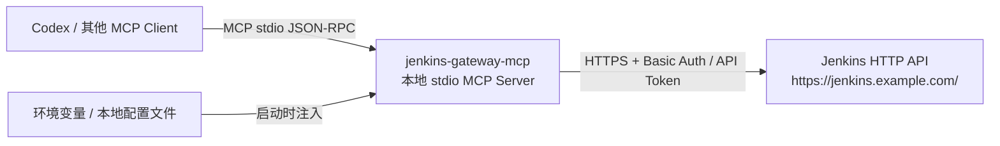

# Jenkins Gateway MCP 技术路线

## 背景与约束

现有 Jenkins 服务器未安装 MCP 插件，且当前账号没有安装插件权限。因此本项目采用本地网关方案：MCP 客户端启动本地 MCP Server，本地 MCP Server 再通过 Jenkins HTTP API 调用远端 Jenkins。

这个方案不需要改动 Jenkins 服务器端，只要求当前账号具备 Jenkins API token 和对应任务权限。

项目发布状态也有约束：未完工期间 GitHub 仓库保持私有，不向 npm registry 发布；在完成 shared core + CLI + MCP + Codex skill 新架构、通过新架构验收、完成安全检查和文档收敛后，再转为公共仓库并发布 npm package。

## 总体架构

## 技术选型

- 运行时：Node.js 20+。
- 语言：TypeScript。
- MCP SDK：`@modelcontextprotocol/sdk`。
- HTTP client：优先使用 Node 内置 `fetch` 或 `undici`。
- 参数校验：`zod`。
- 测试：`vitest`，Jenkins API 使用 mock server 或 HTTP fixture。
- 分发：npm package，提供 CLI bin，例如 `jenkins-gateway-mcp`。

选择 Node.js/TypeScript 的主要原因是跨平台成本低，`npx` 体验直接，且 MCP 官方生态对 stdio server 支持成熟。

## MCP transport

第一阶段只实现 stdio transport。

原因：

- Codex 等本地工具最容易装载 stdio MCP Server。
- 不需要额外端口、证书或后台守护进程。
- 更适合 Windows 与 macOS 的一次性 `npx` 启动模型。

HTTP/SSE transport 可作为后续增强，用于团队共享网关或集中代理，但不是第一阶段目标。

## CLI 与 Skill 演进方向

当前 MCP 方案不应被 `jenkins-cli + skill` 直接替换。推荐演进为 shared core + CLI + MCP + Codex skill 的组合架构：

- shared core 负责 Jenkins HTTP API、认证、参数解析、受保护工具授权、日志边界控制和工作流编排。
- MCP 作为跨客户端协议入口，保持普通读工具与受保护工具边界。
- CLI 作为稳定 JSON 命令入口，服务脚本、CI、本地调试和 Codex skill。
- Codex skill 固化团队 Jenkins 工作流，例如参数化升级、stage/release 分类、组件映射和结果核验。

详细设计见 [CLI + Skill 改进方案](cli-skill-improvement-plan.md)。

## Jenkins API 调用方式

认证方式使用 Jenkins 标准 Basic Auth：

- username：`JENKINS_USER_ID`
- password：`JENKINS_API_TOKEN`

对于 POST 类操作，网关需要支持 Jenkins crumb：

1. 启动后或首次写操作前请求 `/crumbIssuer/api/json`。
2. 如果 Jenkins 开启 CSRF crumb，则缓存 crumb header。
3. POST 请求自动携带 crumb。
4. 如果 crumb 不可用，返回明确错误，不静默重试危险操作。

Job 路径需要兼容 Jenkins folder：

- 逻辑 job path 使用 `/` 分隔，例如 `folder-a/folder-b/job-name`。
- 实际 Jenkins URL 编码为 `/job/folder-a/job/folder-b/job/job-name`。
- 每个 path segment 单独 encode，避免中文、空格、斜杠混淆。

## 第一阶段 MCP tools

| Tool | 类型 | 说明 |
| --- | --- | --- |
| `jenkins.get_server_info` | 只读 | 获取 Jenkins 基础信息、当前用户权限探测结果 |
| `jenkins.list_jobs` | 只读 | 列出根目录或指定 folder 下的 job |
| `jenkins.get_job` | 只读 | 获取 job 基础信息、参数定义、最近构建 |
| `jenkins.get_build` | 只读 | 获取指定 build 的状态、时间、结果、变更摘要 |
| `jenkins.get_console_log` | 受保护读 | 分页读取 console log，默认限制最大返回量，不做内容脱敏 |
| `jenkins.get_queue_item` | 只读 | 查询排队任务状态 |
| `jenkins.trigger_build` | 受保护写 | 触发无参数或参数化构建，默认关闭 |
| `jenkins.stop_build` | 受保护写 | 停止构建，默认关闭 |

受保护工具必须受配置开关控制：

- 普通读工具默认允许读取 Jenkins 元数据。
- 默认 `JENKINS_MCP_ENABLE_PROTECTED_TOOLS=false`。
- 受保护工具包含 `jenkins.get_console_log`、`jenkins.trigger_build`、`jenkins.stop_build`。
- 受保护工具权限粒度支持 all / view / job。
- 权限优先级为 job > view > all，同级冲突时 deny 优先。
- 可通过 `JENKINS_MCP_PROTECTED_ALLOW_ALL` 临时允许全部受保护工具，再用 view/job denylist 排除高风险范围。

## 错误与日志策略

- MCP stdout 只能输出协议消息，日志必须写 stderr。
- 日志中必须脱敏 token、crumb、Authorization header。
- Jenkins 4xx 直接返回可读错误，保留 status code 和 Jenkins message。
- Jenkins 5xx、网络超时返回可重试错误，但不自动重放写操作。
- Console log 作为受保护工具，默认截断或分页，避免 MCP 响应过大。
- Console log 内容不做脱敏，避免破坏排障上下文；服务端不得把原始 console 内容写入 stderr、本地日志或错误对象。

## 账号与环境解耦

代码中不保存任何服务器地址、账号或 token。配置来源按优先级读取：

1. CLI 参数。
2. 环境变量。
3. 指定配置文件 `JENKINS_MCP_CONFIG`。
4. 默认本地配置文件，例如用户 home 下的 `.jenkins-gateway-mcp/config.json`。

仓库只提交 example 文件，本机真实配置使用 `.env.local` 或本地 Codex config 注入。

## 分发路线

### 开发期

开发期仓库保持私有，只在私有 GitHub 仓库中运行 build/test CI。这个阶段可以保留未稳定的接口、内部任务记录和实验文档，但仍不得提交真实 token。

开发期和新架构演进期不发布 npm package。需要在其他机器临时验证时，优先使用本地 checkout 后执行 `npm install && npm run build`，或在私有仓库权限可控的前提下通过 GitHub URL 临时安装。

### 交付期

完成 shared core + CLI + MCP + Codex skill 新架构并通过验收后，再执行公开发布流程：

1. 完成公开前安全检查，确认 Git 历史、文档、示例、测试 fixture 中没有真实凭据。
2. 确认新架构后的 CLI、MCP 和 Skill 文档均已通过私有环境验证。
3. 将 GitHub 仓库从 private 转为 public。
4. GitHub Actions 在 tag/release 时构建 TypeScript 并运行测试。
5. 发布公开 npm package 到 npm registry。
6. MCP 客户端通过 `npx -y jenkins-gateway-mcp` 启动。

如果 `jenkins-gateway-mcp` 包名已被占用，改用公开 scoped package，例如 `@<scope>/jenkins-gateway-mcp`。

## 主要风险

- Jenkins 权限不足：网关需要把权限错误原样暴露，不能包装成泛化失败。
- Job path 编码错误：folder job 需要专门单测。
- 受保护工具误用：默认关闭，必须通过主开关和 all/view/job 显式授权。
- 过早公开：项目未完工、新架构未验收或未完成安全检查时不得转公共仓库，不得发布 npm package。
- 包名冲突：发布前需要确认 npm package name 是否可用；不可用时使用 scoped public package。
- 凭据泄漏：真实 Jenkins token 绝不能进入 Git 历史，泄漏后需要立即轮换。
- 大日志响应：console log 必须分页和限制最大读取量。
- 敏感日志读取：console log 不做内容脱敏，因此必须归入受保护工具。
